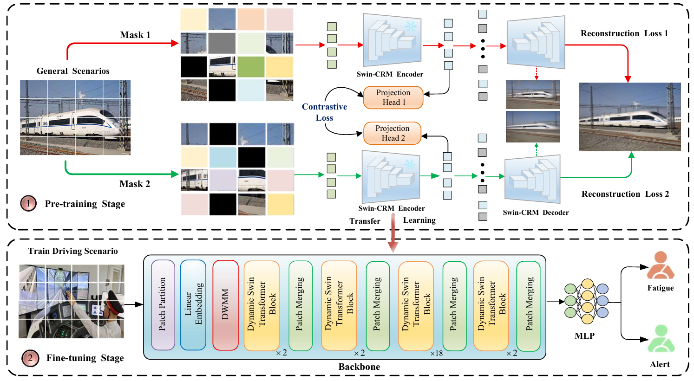

# Swin-MAE with DWMM

## Swin-MAE with Deformable Window Modeling for Train Driver Fatigue Representation Learning

This repository provides a reference implementation of a **Swin-MAE framework enhanced with a Deformable Window Modeling Module (DWMM)** for train driver fatigue representation learning.

The implementation combines masked image reconstruction with a hierarchical Swin Transformer backbone and introduces deformable window modeling to improve the representation of local and fine-grained fatigue-related facial features.

---

## Overview

Train driver fatigue is an important safety concern in railway transportation, particularly during long-duration and monotonous driving operations.

Vision-based fatigue detection requires robust feature representations capable of capturing subtle facial variations under different drivers, postures, and operating conditions. To improve the representation capability of the backbone, this implementation combines **masked image modeling** with a **DWMM-enhanced Swin Transformer**.

During self-supervised pretraining, a large proportion of image patches are masked. The remaining visual information is processed by the Swin Transformer encoder with DWMM to obtain latent feature representations. A lightweight decoder is then used to reconstruct the masked image patches.

The learned encoder can subsequently be transferred to downstream train driver fatigue classification tasks.

---

## Framework

<p align="center">
  
</p>

<p align="center">
  <b>Overview of the Swin-MAE framework with DWMM.</b>
</p>

The overall learning process can be summarized as:

```text
Input Image
    |
    v
Patch Embedding
    |
    v
Patch Masking
    |
    v
Swin Transformer + DWMM
    |
    v
Latent Representation
    |
    v
Lightweight Decoder
    |
    v
Masked Patch Reconstruction
```

The framework mainly consists of two components:

1. **Deformable Window Modeling Module (DWMM)**
2. **Masked Image Reconstruction Learning**

---

## Deformable Window Modeling Module

The **Deformable Window Modeling Module (DWMM)** is incorporated into the window-based self-attention mechanism to improve adaptive local feature representation.

Conventional window attention operates on fixed spatial sampling locations. In contrast, DWMM introduces learnable spatial offsets that allow the sampling positions within each local window to be dynamically adjusted according to the input features.

The module incorporates several mechanisms, including:

- Learnable spatial offsets
- Bilinear feature resampling
- Deformation gating
- Local positional enhancement
- Deformable Window Multi-Head Self-Attention (DW-MSA)
- Deformable Shifted Window Multi-Head Self-Attention (DSW-MSA)

By integrating deformable feature sampling with shifted-window attention, DWMM enables the backbone to capture more flexible local dependencies and fine-grained facial patterns related to fatigue.

---

## Reconstruction Learning

The reconstruction learning branch follows a masked image modeling strategy and encourages the encoder to learn contextual and structural information from partially observed facial images.

During pretraining, approximately 75% of the input image patches are masked, while the remaining visual information is encoded by the DWMM-enhanced Swin Transformer.

The encoded latent representations are then passed through a lightweight decoder to predict the missing image patches.

The reconstruction error is calculated over the masked regions, encouraging the model to infer missing visual information from the surrounding context.

Through this process, the encoder learns robust representations containing local facial structures, contextual dependencies, and fine-grained appearance information that can be transferred to downstream fatigue recognition tasks.

---

## Dataset

The experiments are conducted using a train driver fatigue dataset containing facial images collected under different driving conditions.

The dataset includes:

- Multiple train drivers
- Different driving postures
- Fatigue and non-fatigue states
- Long-duration driving recordings
- Subject-independent experimental settings

Due to privacy and institutional regulations, the dataset is not publicly downloadable at this stage.

Researchers interested in academic collaboration may contact the authors for further information.

---

## Experimental Setting

The downstream fatigue recognition task is formulated as a binary classification problem:

```text
0 = fatigue
1 = nofatigue
```

Subject-independent evaluation can be performed using a **Leave-One-Subject-Out (LOSO)** protocol.

For each evaluation:

```text
Training:    N - 1 subjects
Evaluation:  1 unseen subject
```

This protocol is used to evaluate the generalization capability of the learned representations across different train drivers.

Common evaluation metrics include:

- Accuracy
- Precision
- Recall
- F1-score
- Balanced Accuracy
- ROC-AUC

---

## Requirements

The recommended environment is:

```text
Python 3.10
PyTorch
torchvision
timm
NumPy
SciPy
scikit-learn
OpenCV
Pillow
Matplotlib
```

Create a Conda environment:

```bash
conda create -n fatigue python=3.10 -y
conda activate fatigue
```

Upgrade the basic Python packaging tools:

```bash
python -m pip install --upgrade pip setuptools wheel
```

Install PyTorch:

```bash
pip install \
torch==2.7.1 \
torchvision==0.22.1 \
torchaudio==2.7.1 \
--index-url https://download.pytorch.org/whl/cu128
```

Install the remaining dependencies:

```bash
pip install -r requirements.txt
```

---

## Project Structure

```text
Swin-MAE-DWMM/
|
|-- configs/
|
|-- data/
|
|-- models/
|   |-- swin_mae_dwmm_model.py
|
|-- output/
|
|-- requirements.txt
|
|-- README.md
```

The main model implementation is located in:

```text
models/swin_mae_dwmm_model.py
```

---

## Pretraining

The self-supervised pretraining framework combines **Swin Transformer, DWMM, and masked image reconstruction learning**.

During pretraining, masked facial images are processed by the DWMM-enhanced Swin encoder to obtain latent feature representations. A lightweight decoder subsequently reconstructs the missing image patches from the encoded features.

This learning process encourages the encoder to capture contextual dependencies and fine-grained facial information from unlabeled images.

The pretrained encoder can then be transferred to downstream train driver fatigue classification tasks.

---

## Reconstruction Visualization

The reconstruction results can be visualized to examine the masked image modeling process.

A typical visualization contains:

```text
Original Image
      |
      v
Masked Image
      |
      v
Reconstructed Image
```

The reconstructed results provide an intuitive representation of the visual information learned by the model during self-supervised pretraining.

---

## Downstream Application

After self-supervised pretraining, the learned Swin-MAE + DWMM encoder can be transferred to downstream fatigue recognition tasks.

For binary train driver fatigue detection, the encoder is combined with a classification head to predict:

```text
fatigue
nofatigue
```

The pretrained representation can also be used as initialization for other subject-independent visual recognition experiments.

---

## Evaluation

The downstream model can be evaluated using common classification metrics, including:

```text
Accuracy
Precision
Recall
F1-score
Balanced Accuracy
ROC-AUC
```

For cross-subject experiments, LOSO evaluation is recommended to measure the generalization capability of the model on unseen subjects.

---

## Citation

Citation information will be updated after the corresponding work is published.

```bibtex
@article{swin_mae_dwmm,
  title   = {Swin-MAE with Deformable Window Modeling for Train Driver Fatigue Representation Learning},
  author  = {To be updated},
  journal = {To be updated},
  year    = {To be updated}
}
```

---

## Contact

For questions regarding the implementation, dataset, or academic collaboration, please contact the authors.

---

## Acknowledgements

This implementation is built upon research on Swin Transformer and masked image modeling.

We thank the corresponding authors and open-source communities for their valuable contributions.
